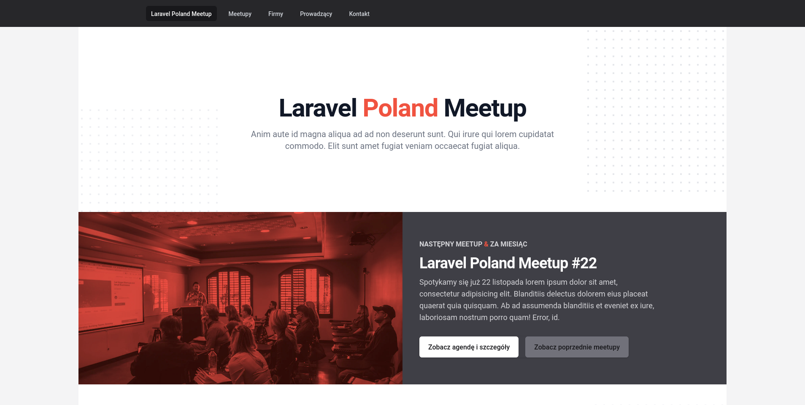

## laravel-poland-meetup (work in progress)
This is a source code for the **Laravel Poland Meetup** official website.



### Development
Static database is built from JSON files from `resources` directory. PHP builder script can be run from Docker container (and requires some vendor installations):
```bash
docker-compose up -d
docker-compose exec php composer install
docker-compose exec php php backend/builder.php
```

Frontend can be run from another container (also with node modules installed):
```bash
docker-compose exec node npm install
docker-compose exec node npm run dev
```

Or you can just run:
```bash
make setup
```

Copy `.env.example` file and change it name to `.env`:
```bash
cp .env.example .env
```
Add token to `VITE_VUE_APP_MAPBOX_TOKEN` in `.env`

#### Codestyle
Linters for backend and frontend are available:
```bash
docker-compose exec php composer cs
docker-compose exec node npm run lint
```

Fixers for backend and frontend are available:
```bash
docker-compose exec php composer csf
docker-compose exec node npm run lintf
```

### Deployment
The website should be automatically deployed to GitHub Pages with every pull requests to the `main` branch.
